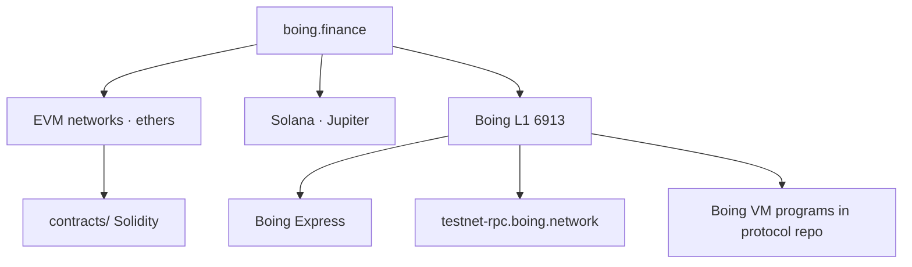

# 💱 boing.finance

Cross-chain DeFi: **EVM** (TokenFactory, Sepolia DEX, LI.FI), **Solana** (SPL deploy, Jupiter), and **Boing Network L1** (native VM AMM via Boing Express).

> 👋 **Everyday users:** open [boing.finance](https://boing.finance), connect a wallet, swap or deploy. On Boing L1 you need [Boing Express](https://boing.express) — MetaMask cannot sign 32-byte Boing accounts.  
> 🛠️ **Developers:** Vite + React frontend, Cloudflare Workers + D1 backend. Boing path is `boing-sdk` + Express, **not** the Solidity tree.  
> 🛰️ **Operators:** canonical env is `frontend/.env.example`. Live EVM addresses: `frontend/src/config/contracts.js`. Smoke: `cd frontend && npm run smoke:boing-rpc`.



Frontend is **Vite + React 18**. Backend is **Cloudflare Workers + D1**.

## Architecture

```
├── frontend/          # Vite React app (build output: dist/)
├── backend/           # Cloudflare Workers API (Hono)
├── contracts/         # Solidity (EVM only — not loadable on Boing VM)
└── docs/              # Start at docs/README.md
```

### Boing Network L1 (chain 6913)

Boing L1 runs the **Boing VM**, not EVM application bytecode. There is no compiler switch that turns `contracts/` into Boing bytecode.

Native swap, pool discovery, and operator handoffs: **[docs/native-dex.md](./docs/native-dex.md)** and **[docs/native-dex-discovery.md](./docs/native-dex-discovery.md)**. Upstream: [HANDOFF-DEPENDENT-PROJECTS.md](https://github.com/Boing-Network/boing.network/blob/main/docs/HANDOFF-DEPENDENT-PROJECTS.md).

Hosted Fly testnet currently may have **`end_user.canonical_native_*` = null** — the app must not treat historical SDK hexes as live.

## Tech stack

- **Frontend:** React 18, Vite, Tailwind CSS, Framer Motion, React Query, ethers.js, `@solana/web3.js`, `boing-sdk`
- **Backend:** Cloudflare Workers, Hono, D1, Drizzle ORM
- **Contracts:** Solidity, Hardhat, OpenZeppelin (EVM only)

## Quick start

Prerequisites: Node.js 18+, npm, Git.

```bash
git clone <repository-url>
cd boing.finance

# Backend
cd backend && npm install && npm run dev

# Frontend (separate terminal) — Vite on port 3000
cd frontend && npm install && npm start
# http://localhost:3000
```

From the repo root: `npm run dev` runs backend and frontend together.

### Smart contracts (optional, EVM)

```bash
cd contracts
npm install
npm run compile
npm run check:dex
# DEX deploy: npm run deploy:dex -- --network sepolia
```

## Deployment

**GitHub Actions:** push to `main` → production; `staging` → staging. Secrets: `CLOUDFLARE_API_TOKEN`, `CLOUDFLARE_ACCOUNT_ID`. Details: [docs/deployment.md](./docs/deployment.md).

```bash
./deploy-backend.sh staging    # or production
./deploy-frontend.sh staging
```

Cloudflare Pages (manual): root `frontend`, build `npm install && npm run build:prod`, output **`dist`**.

## Documentation

See **[docs/README.md](./docs/README.md)** for the full index.

| Document | Description |
|----------|-------------|
| [docs/native-dex.md](./docs/native-dex.md) | Boing L1 vs EVM DEX, roadmap, indexer |
| [docs/native-dex-discovery.md](./docs/native-dex-discovery.md) | L1 list RPCs + operator handoff |
| [docs/deployment.md](./docs/deployment.md) | Cloudflare Workers/Pages |
| [docs/configuration.md](./docs/configuration.md) | Env vars |
| [docs/contracts.md](./docs/contracts.md) | EVM TokenFactory / DEX |
| [docs/integration.md](./docs/integration.md) | Networks, Solana, swap market data |
| [frontend/docs/DESIGN.md](./frontend/docs/DESIGN.md) | Visual system |

## Configuration

**Backend secrets** (Wrangler): RPC URLs, `JWT_SECRET`, optional `LIFI_API_KEY` / `JUPITER_API_KEY`.

**Frontend** (Cloudflare Pages or `frontend/.env.local`):

```bash
REACT_APP_ENV=production
REACT_APP_BACKEND_URL=https://boing-api-prod.nico-chikuji.workers.dev
```

All `REACT_APP_*` values are public in the bundle.

## API

Workers mount routes in `backend/src/worker.js` (`/api/dex`, `/api/aggregator`, `/api/governance`, `/api/solana`, …). Health: `GET /`.
