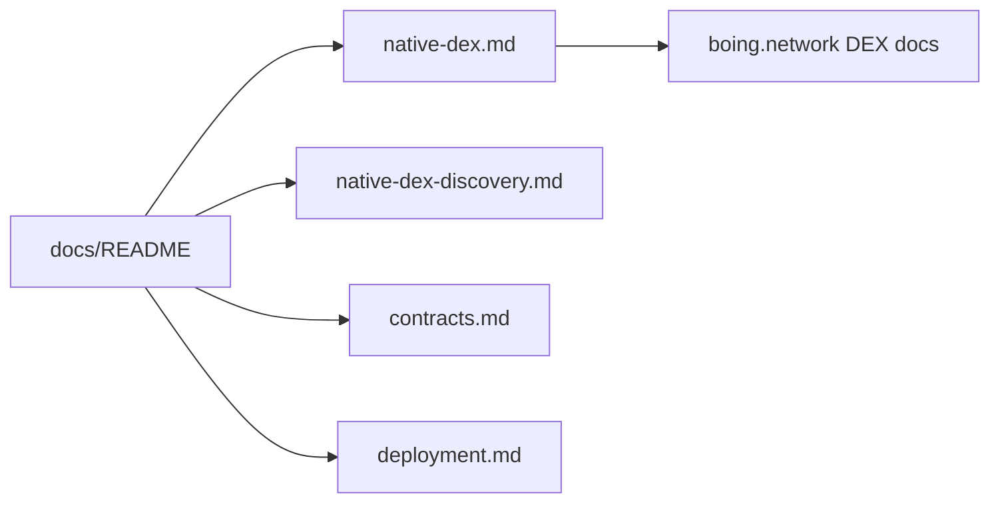

# 📚 boing.finance — documentation index

> 👋 **Everyday users:** the app is [boing.finance](https://boing.finance). Connect [Boing Express](https://boing.express) for Boing L1; other wallets for EVM/Solana.  
> 🛠️ **Developers:** this folder is the engineering map. Canonical env: `frontend/.env.example`. Live EVM addresses: `frontend/src/config/contracts.js`.  
> 🛰️ **Operators:** `cd frontend && npm run smoke:boing-rpc` against public testnet.

Canonical **env vars:** `frontend/.env.example`. Canonical **EVM addresses:** `frontend/src/config/contracts.js`.

| Doc | Description |
|-----|-------------|
| [native-dex.md](./native-dex.md) | Boing L1 vs EVM, VM deploy/Observer, roadmap, Uniswap-parity matrix, indexer |
| [native-dex-discovery.md](./native-dex-discovery.md) | `boing_listDexTokens` / `boing_listDexPools` spec, client wiring, operator definition of done |
| [contracts.md](./contracts.md) | TokenFactory / DEXFactory status and EVM DEX operator runbook |
| [contract-registry.md](./contract-registry.md) | Historical addresses and verification links (mirror of `contracts.js`) |
| [deployment.md](./deployment.md) | Cloudflare Workers/Pages, production checklist, cost plan |
| [configuration.md](./configuration.md) | Production env + optional API keys |
| [adding-a-network.md](./adding-a-network.md) | Add a chain in `networks.js` + `contracts.js` |
| [integration.md](./integration.md) | Network prioritization, capability matrix, swap market data |
| [solana.md](./solana.md) | Solana wallet, SPL deploy, Jupiter |
| [product-roadmap.md](./product-roadmap.md) | Product ideas backlog (not an engineering spec) |
| [boing-tokenomics.md](./boing-tokenomics.md) | BOING token economics (mostly planned) |
| [../frontend/docs/DESIGN.md](../frontend/docs/DESIGN.md) | App visual system |
| [../contracts/GOVERNANCE_CONTRACTS.md](../contracts/GOVERNANCE_CONTRACTS.md) | Governance deploy (undeployed) |
| [../contracts/CONTRACTS_AUDIT.md](../contracts/CONTRACTS_AUDIT.md) | Historical audit notes |
| [../scripts/README.md](../scripts/README.md) | Optional Python asset scripts |

**Upstream (Boing Network):** [HANDOFF-DEPENDENT-PROJECTS.md](https://github.com/Boing-Network/boing.network/blob/main/docs/HANDOFF-DEPENDENT-PROJECTS.md) — Express, Observer, partner dApp backlog.

**Ops:** from `frontend/`, `npm run smoke:boing-rpc` verifies public Boing testnet JSON-RPC (`boing_chainHeight`; optional `boing_qaCheck` via `BOING_SMOKE_BYTECODE_HEX`).
