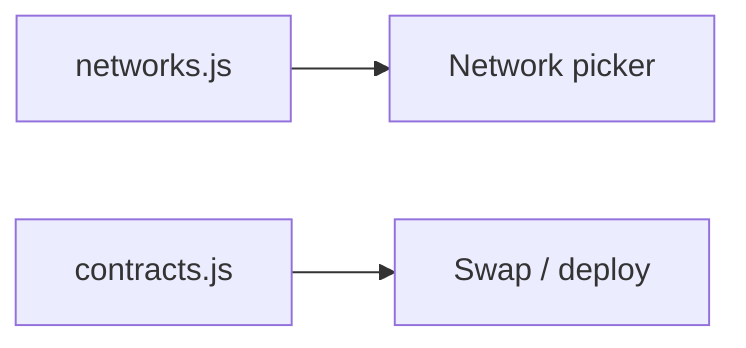

# Adding a New Blockchain Network

> 👋 **Everyday users:** you pick networks in the UI; you do not edit this file.  
> 🛠️ **Developers:** add the chain to `frontend/src/config/networks.js`, then optionally `contracts.js`.  
> 🛰️ **Operators:** Boing L1 (6913) is already first-class — do not add it as an EVM clone.

Boing.finance is designed so that adding a new chain is a **single-point change** for the UI and wallet: add the network to the central config, then optionally add contract addresses when you deploy.



## 1. Add the network (required)

Edit **`frontend/src/config/networks.js`** and add a new entry to the `NETWORKS` object keyed by **chain ID** (number).

```js
  YOUR_CHAIN_ID: {
    name: 'Your Network Name',
    symbol: 'ETH',                    // or native symbol (e.g. MATIC, BNB)
    rpcUrl: process.env.REACT_APP_YOUR_CHAIN_RPC_URL || 'https://...',
    explorer: 'https://...',
    chainId: YOUR_CHAIN_ID,
    nativeCurrency: { name: 'Ether', symbol: 'ETH', decimals: 18 },
    blockTime: 2,
    gasLimit: 30000000,
    isTestnet: false,
    priority: 20,                     // sort order in selectors (lower = first)
    features: []                      // optional: e.g. 'rollup', 'dexDeployed'
  }
```

- **RPC URL:** Prefer env vars (e.g. `REACT_APP_YOUR_CHAIN_RPC_URL`) and document them in `frontend/.env.example`.
- **Explorer:** Block explorer base URL (e.g. `https://yourscan.io`).
- **priority:** Lower numbers appear first in network selectors; mainnets usually 1–10, testnets and extra chains 10+.

After this step:

- The network appears in the **Network selector** and in **Bridge** (from/to).
- **Wallet “Add network”** uses this config via `getWalletAddChainParams(chainId)`.
- **useNetwork** and any UI using `getNetworkByChainId()` / `getSupportedNetworks()` will include the new chain.

## 2. Add contract addresses (when you deploy)

If you deploy Boing contracts (TokenFactory, DEX, etc.) on this chain, add an entry in **`frontend/src/config/contracts.js`** keyed by the same **chain ID** (number).

- Copy the structure from an existing chain (e.g. Sepolia or Ethereum).
- Set each deployed contract address; use `'0x0000000000000000000000000000000000000000'` for not-yet-deployed contracts.
- **TokenFactory / TokenImplementation:** Required for **Deploy Token**.
- **dexFactory / dexRouter / weth:** Required for **Swap (Boing DEX)** and **Liquidity**. **Create Pool** also works on Uniswap V2–compatible venues listed in `frontend/src/config/uniswapV2Compat.js` (PancakeSwap V2 on BNB). Ethereum is not in the Boing DEX rollout; see [contracts.md](./contracts.md).

After this step:

- **Deploy Token** works on this chain if `tokenFactory` (and `tokenImplementation`) are set.
- **Create Pool** uses the Boing DEX when `dexFactory` and `dexRouter` are non-zero; otherwise it uses a mapped Uniswap/Pancake V2 factory if one exists for the chain.
- **Liquidity** uses the Boing DEX on this chain only if `dexFactory` and `dexRouter` are non-zero.
- **Feature support** is derived in `frontend/src/config/featureSupport.js` from these addresses (no need to edit that file when adding a chain).

## 3. Optional: Backend / env

- If the backend or frontend call chain-specific RPCs, add the RPC URL to the right env (e.g. Cloudflare Workers secrets, or `frontend/.env.example`).
- Document the new variable in **`frontend/.env.example`** (and mention it in [configuration.md](./configuration.md) only if it is required for production).

## Summary

| Step | File | Purpose |
|------|------|--------|
| 1 | `frontend/src/config/networks.js` | Add chain (name, RPC, explorer, native currency). Required for UI and wallet. |
| 2 | `frontend/src/config/contracts.js` | Add contract addresses when deployed. Enables Deploy Token / DEX features on that chain. |
| 3 | `frontend/.env.example` | RPC and API keys; keep `docs/configuration.md` as the production checklist only. |

No need to change:

- `featureSupport.js` (reads from `contracts.js`; Create Pool also reads `uniswapV2Compat.js`)
- `useNetwork.js` (reads from `networks.js`)
- Bridge or other pages that use `getSupportedNetworks()` or `getNetworkByChainId()`

Adding a chain is therefore: **one block in `networks.js`**, and when relevant **one block in `contracts.js`**.
