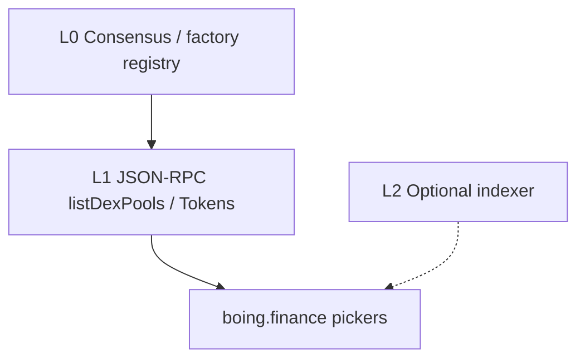

# Native DEX discovery (L1 RPC + indexer)

> 👋 **Everyday users:** token and pool pickers should show what the chain actually has — not a private spreadsheet.  
> 🛠️ **Developers:** prefer L1 RPCs (`boing_listDexPools` / `boing_listDexTokens`) for “what exists”; use an indexer only for enrichment.  
> 🛰️ **Operators:** advertise methods in `boing_rpcSupportedMethods` / `boing_getRpcMethodCatalog`. Factory must be published on `end_user.canonical_native_dex_factory`.

**Audience:** Boing Network core / RPC / indexer, and this repo’s frontend.  
**Goal:** Token and pool discovery that any client can call **from chain state**, without trusting a single operator-hosted database as the source of truth.

Architecture overview: [native-dex.md](./native-dex.md).  
Env catalog: `frontend/.env.example`.

*Last reviewed: August 2026.*



---

## 1. Problem

- EVM chains have **no native “list all ERC-20s” RPC**. Clients scan logs, read factories, or use an indexer.
- Boing L1 uses **32-byte VM account ids**, not 20-byte EVM addresses.
- “Auto-recognition” / “global token API” must be a **documented Boing RPC + pagination contract** — not an unbounded list of every ledger account.

---

## 2. Architecture (layers)

| Layer | Responsibility | Trust |
|--------|-----------------|-------|
| **L0 — Consensus / state** | Factory registry, pool accounts, token metadata | Trust the chain |
| **L1 — Boing JSON-RPC** | Cursor-paginated reads (`boing_listDexTokens` / `boing_listDexPools`) | Trust your RPC node (or run your own) |
| **L2 — Optional indexer** | Pre-aggregated stats, USD, history, search | Trust indexer *or* self-host / verify against L0–L1 |

The dApp **prefers L0/L1** for “what exists” and **L2** for enrichment.

---

## 3. Proposed / implemented RPC (L1)

Exact names follow existing `boing_*` convention. Implement and **advertise** in `boing_rpcSupportedMethods` / `boing_getRpcMethodCatalog` so clients do not rely on probing.

### `boing_listDexPools` (paginated)

Enumerate constant-product pools registered with the native DEX factory.

**Parameters:** `cursor` (opaque, optional), `limit` (default `100`, max `500`). Optional `factory` overrides `BOING_CANONICAL_NATIVE_DEX_FACTORY`.

**Returns:**

```json
{
  "pools": [
    {
      "poolHex": "0x…64hex…",
      "tokenAHex": "0x…64hex…",
      "tokenBHex": "0x…64hex…",
      "feeBps": 30,
      "reserveA": "…decimal string…",
      "reserveB": "…decimal string…",
      "createdAtHeight": 12345
    }
  ],
  "nextCursor": "opaque-or-null"
}
```

`createdAtHeight` is filled from committed receipts when **`light` is not set**; `light: true` or `enrich: false` skips scans. Rows should include **token decimals** when known (`tokenADecimals` / `tokenBDecimals`).

### `boing_listDexTokens` (trade-relevant universe)

Not every random ledger account — **every token id that appears in a registered DEX pool** (plus optional extensions). Dust filters: `minReserveProduct` or `minLiquidityWei`.

```json
{
  "tokens": [
    {
      "id": "0x…64hex…",
      "symbol": "TKN",
      "name": "Example",
      "decimals": 18,
      "poolCount": 2,
      "firstSeenHeight": 12000
    }
  ],
  "nextCursor": null
}
```

### `boing_getDexToken`

`{ "id": "0x…64hex…" }` → one token row, or `null`.

### Node-side notes (boing.network)

- **Token labels:** recent blocks (`BOING_DEX_TOKEN_METADATA_SCAN_BLOCKS`, default 8192) scanned for `ContractDeployWithPurposeAndMetadata`; response includes `metadataSource` (`deploy` | `abbrev`).
- **Receipt scan cap:** `BOING_DEX_DISCOVERY_MAX_RECEIPT_SCANS` (default 500000; `0` = unlimited). `includeDiagnostics: true` returns counters.
- **Decimals override:** `BOING_DEX_TOKEN_DECIMALS_JSON` — `"0x" + 64 hex` → number (default 18).

### Indexer / HTTP mirror (L2)

Align indexer JSON with the RPC shapes (`frontend/src/services/nativeDexIndexerClient.js`). Minimum:

- `updatedAt` (ISO)
- `pools[]` with `poolHex`, `tokenAHex`, `tokenBHex`, reserves if available
- `tokenDirectory[]` with `id` (64 hex), `symbol`, `name` (optional `decimals`)
- Prefer `schemaVersion: 1` at the root

`extractTokenDirectoryFromIndexer` accepts `tokenDirectory` or **`tokens`** at the payload root.

---

## 4. Security & spam

Discovery means **existence**, not endorsement. Node-side filters: minimum liquidity, minimum pool age, optional fee for registry listing. Optional signed token lists (IPFS) as a **parallel** curated channel.

---

## 5. What this dApp already does (no chain change)

| Source | Role |
|--------|------|
| `boing_getNetworkInfo` | Default CP pool / factory hints |
| `boing_listDexPools` (paginated) | New pairs without client log scans |
| `boing_listDexTokens` (paginated) | Trade-relevant token set |
| Optional indexer URL | TVL, labels, history — **enrichment** |
| Register-pair log scan | Fallback **only if** `REACT_APP_BOING_NATIVE_DEX_REGISTER_LOG_FROM_BLOCK` is set |

**Swap** tab = canonical/default CP pool. **New factory pairs** → **Pools** + **Smart route**.

**EVM (any chain with `dexFactory`):** client scans `PairCreated` logs (chunked `eth_getLogs`) and merges those addresses into Swap / Create Pool pickers (including zero-balance tokens that already have pools).

**Indexer URL resolution:** `localStorage` key `boing_native_dex_indexer_stats_url_override_v1` → then `REACT_APP_BOING_NATIVE_DEX_INDEXER_STATS_URL`. UI: Boing native trade → “Discovery: custom indexer URL”.

---

## 6. Client implementation (shipped)

L1 list RPCs are **wired** in this repo. Remaining gaps are **node coverage / catalog advertisement**, not missing frontend modules.

| Piece | Role |
|-------|------|
| `frontend/src/services/nativeDexL1Discovery.js` | Capability detection, opaque cursor pagination, `light: true` list calls |
| `frontend/src/contexts/BoingNativeDexIntegrationContext.jsx` | Loads L1 tokens/pools; merges indexer + on-chain hydration |
| `frontend/src/services/nativeDexIndexerClient.js` | Indexer URL + token directory parsing |
| `frontend/src/utils/nativePoolReserveFormat.js` | Reserve display when decimals are known |

`resolveNativeDexL1DiscoveryCapabilities` unions `boing_rpcSupportedMethods` and `boing_getRpcMethodCatalog`. If **both** lists are empty, it **probes** list methods once (`-32601` = absent). Optional `preflightRpc` does not change those flags; it fills `dexDiscoveryRpcMeta` for Developer tools.

`boing_listDexPools` rows stay as `l1DexPoolRows`; `attachDexPoolDecimalsToVenues` merges decimals onto `venues`.

**SDK:** `boing-sdk` ≥ **0.3.0** (`listDexTokensPage`, `listDexPoolsPage`, `getDexToken`). This repo uses `file:../boing.network/boing-sdk`.

| Area | Status |
|------|--------|
| L1 token directory | Paginated `boing_listDexTokens` (`light: true`); L1 **overwrites** indexer labels for the same `id` |
| L1 pool directory | Merged into `venues` then hydrated; disable with `REACT_APP_BOING_NATIVE_DEX_DISCOVERY_POOLS=0` |
| Pagination | Opaque cursors; `REACT_APP_BOING_NATIVE_DEX_DISCOVERY_MAX_PAGES` (default 100, cap 250) |
| Spam / dust | Optional `MIN_LIQUIDITY_WEI` / `MIN_RESERVE_PRODUCT` forwarded to the node |

| Variable | Purpose |
|----------|---------|
| `REACT_APP_BOING_NATIVE_DEX_DISCOVERY_POOLS` | `0` = skip merging `boing_listDexPools` into venues |
| `REACT_APP_BOING_NATIVE_DEX_DISCOVERY_MAX_PAGES` | Max paginated RPC pages (default 100, cap 250) |
| `REACT_APP_BOING_NATIVE_DEX_DISCOVERY_MIN_LIQUIDITY_WEI` | Forwarded to `boing_listDexTokens` |
| `REACT_APP_BOING_NATIVE_DEX_DISCOVERY_MIN_RESERVE_PRODUCT` | Forwarded to `boing_listDexTokens` |
| `REACT_APP_BOING_NATIVE_DEX_DISCOVERY_PREFLIGHT` | `1` = run `preflightRpc()` (Developer tools metadata) |

---

## 7. Operator definition of done

On **Boing testnet** (or mainnet when live), after a user deploys a fungible token and registers a CP pool with the DEX factory, **without editing dApp source**:

- The new pool appears in **Pools** after Refresh / a short wait (list RPCs must be live and advertised).
- The user can open **Smart route** with prefilled legs or pick tokens that include **on-chain** symbols/names.
- Swapping uses the same **Boing Express** flow as the default pool.

If routine pairs still require **copy-pasting 64-character hex**, treat that as a **node / RPC gap** first, then indexer.

Also needed:

1. Stable `boing_getNetworkInfo` (or equivalent) **non-zero default pool / factory**.
2. Register-pair / factory events queryable so Smart route can build paths if list RPCs lag.
3. Optional public indexer for sorting/charts — **must not** be the only way to learn a pool exists.

**Acceptance (network team):** stable pagination ordering; p95 budget for `limit=100`; OpenRPC/Markdown next to other `boing_*` methods; SDK typed helpers; fixture JSON + golden RPC responses in CI.

---

## 8. Message for Boing Network stakeholders

> For third-party DeFi frontends (including boing.finance) to auto-surface newly deployed tokens and factory pools, we need production `boing_listDexPools` and `boing_listDexTokens` on public RPC—paginated, advertised in the RPC method catalog, and updated as new blocks finalize—plus stable `boing_getNetworkInfo` defaults. Without that, wallets and dApps cannot offer Uniswap-style “see new pair → swap” without fragile log scans or a centralized token list. Optional indexers remain useful for TVL and search ranking, but **L1 discovery RPCs are the baseline**. Spec: `docs/native-dex-discovery.md` in boing.finance.

Upstream checklist: [HANDOFF-DEPENDENT-PROJECTS.md](https://github.com/Boing-Network/boing.network/blob/main/docs/HANDOFF-DEPENDENT-PROJECTS.md).
